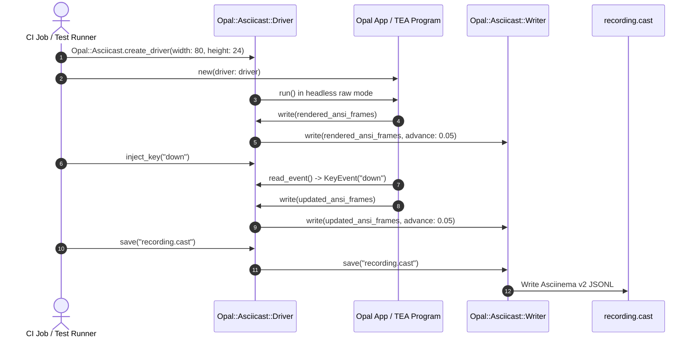

# 🎬 Architecture: Asciicast Terminal Recording (`opal/asciicast`)

This document details the architectural design, lifecycle, and usage patterns of Opal's standardized Asciinema recording subsystem (`Opal::Asciicast`).

---

## 📑 Table of Contents

- [Overview & Modular Design](#-overview--modular-design)
- [Asciinema v2 Format Specification](#-asciinema-v2-format-specification)
- [Class Hierarchy & Subsystems](#-class-hierarchy--subsystems)
- [Headless Recording with `Asciicast::Driver`](#-headless-recording-with-asciicastdriver)
- [Complete Copy-Pasteable Examples](#-complete-copy-pasteable-examples)
  - [Example 1: Programmatic Screen Recording with `Asciicast.record`](#example-1-programmatic-screen-recording-with-asciicastrecord)
  - [Example 2: Headless Recording of Form Wizards & TEA Apps](#example-2-headless-recording-of-form-wizards--tea-apps)
  - [Example 3: Verifying & Parsing Cast Recordings in Specs](#example-3-verifying--parsing-cast-recordings-in-specs)
  - [Example 4: Uploading Recordings to Asciinema.org](#example-4-uploading-recordings-to-asciinemaorg)
- [API Reference](#-api-reference)

---

## 🌟 Overview & Modular Design

Opal's asciicast subsystem provides first-class support for creating, parsing, and uploading terminal session recordings in the standard **Asciinema v2 (`.cast`)** format.

### Optional Require Isolation
To keep the core Opal framework ultra-lightweight and free of JSON or HTTP overhead when building standard CLI tools and TUIs, the asciicast subsystem is packaged as an **optional require**:

```crystal
require "opal"            # Standard Opal framework
require "opal/asciicast"  # Opt into Asciinema v2 recording & parsing
```

When required, `opal/asciicast` equips applications with:
1. **`Opal::Asciicast::Writer`**: High-level recording engine that converts `UI::Buffer` frames, simulated typing cadence, and screen manipulation into timed ANSI events.
2. **`Opal::Asciicast::Reader`**: Parser reading `.cast` files or streams into structured `Recording` objects with duration, outputs, and event filtering.
3. **`Opal::Asciicast::Driver`**: Headless `Terminal::Driver` that records live application writes directly into an asciicast stream, allowing any `Opal.form`, `Opal::TEA::Program`, prompt, or interactive UI to be recorded headlessly.
4. **`Opal::Asciicast::Uploader`**: Client for publishing `.cast` recordings to Asciinema.org and generating embeddable SVG markdown badges.

---

## 📄 Asciinema v2 Format Specification

An Asciinema v2 recording is a newline-delimited JSON (JSONL) document composed of:
- **Line 1 (Header)**: A JSON object describing session metadata:
  ```json
  {"version":2,"width":80,"height":24,"timestamp":1700000000,"title":"Opal Demo","env":{"TERM":"xterm-256color","SHELL":"/bin/bash"}}
  ```
- **Lines 2+ (Events)**: JSON arrays representing timed events in seconds:
  ```json
  [0.05, "o", "\u001b[?25l\u001b[2J\u001b[H"]
  [0.25, "i", "ls\r"]
  [0.30, "o", "src  spec  README.md\r\n"]
  [1.50, "m", "benchmark-start"]
  ```

Event types supported by the spec:
- `"o"`: Terminal output (ANSI escape codes, UTF-8 text, cursor positions, colors).
- `"i"`: Terminal input (simulated user typing or keypresses).
- `"m"`: Timeline markers for navigation chapters.

---

## 🏛️ Class Hierarchy & Subsystems

```mermaid
classDiagram
    class TerminalDriver {
        <<abstract>>
        +size() {Int32, Int32}*
        +raw_mode(&)*
        +write(str : String)*
        +flush()*
        +read_event() KeyEvent | MouseEvent | Nil
        +clear()
        +move_to(r : Int32, c : Int32)
    }

    class Header {
        +version : Int32 = 2
        +width : Int32
        +height : Int32
        +timestamp : Int64
        +title : String?
        +env : Hash(String, String)?
        +theme : Hash(String, String)?
        +idle_time_limit : Float64?
        +to_json() String
        +from_json(json : String)$ Header
    }

    class Event {
        +time : Float64
        +type : String
        +data : String
        +output? : Bool
        +input? : Bool
        +marker? : Bool
        +to_json() String
        +from_json(json : String)$ Event
    }

    class Writer {
        +header : Header
        +events : Array(Event)
        +elapsed : Float64
        +width : Int32
        +height : Int32
        +title : String
        +write(data : String, advance : Float64) Nil
        +write_input(data : String, advance : Float64) Nil
        +write_marker(label : String, advance : Float64) Nil
        +type_text(text : String, cps : Float64, jitter : Float64) Nil
        +pause(seconds : Float64) Nil
        +clear_screen(advance : Float64) Nil
        +move_to(row : Int32, col : Int32, advance : Float64) Nil
        +draw_buffer(buf : UI::Buffer, advance : Float64) Nil
        +save(filename : String) Nil
        +to_s() String
    }

    class Reader {
        +from_file(path : String)$ Recording
        +from_string(content : String)$ Recording
        +from_io(io : IO)$ Recording
    }

    class Recording {
        +header : Header
        +events : Array(Event)
        +duration : Float64
        +outputs : Array(Event)
        +inputs : Array(Event)
        +markers : Array(Event)
        +total_output_text() String
    }

    class AsciicastDriver {
        +writer : Writer
        +time_advance : Float64
        +event_queue : Array(KeyEvent | MouseEvent)
        +size() {Int32, Int32}
        +write(str : String) Nil
        +flush() Nil
        +inject_event(ev : KeyEvent | MouseEvent) self
        +inject_key(name : String) self
        +inject_mouse(x : Int32, y : Int32) self
        +save(filename : String) Nil
    }

    class Uploader {
        +upload_file(filepath : String, install_id : String)$ UploadResult
        +get_or_create_install_id()$ String
    }

    TerminalDriver <|-- AsciicastDriver : inherits
    AsciicastDriver o-- Writer : records to
    Writer *-- Header : contains
    Writer *-- Event : records stream of
    Reader ..> Recording : parses into
    Recording *-- Header : contains
    Recording *-- Event : contains
```

---

## 🎥 Headless Recording with `Asciicast::Driver`

Instead of running external capture utilities or requiring an active TTY, `Opal::Asciicast::Driver` acts as a drop-in `Terminal::Driver`. You can instantiate your application, feed synthetic inputs, and record flawless, 60fps asciicasts directly from automated tests or CI pipelines:



---

## 💻 Complete Copy-Pasteable Examples

### Example 1: Programmatic Screen Recording with `Asciicast.record`

```crystal
require "opal"
require "opal/asciicast"

Opal::Asciicast.record(
  output_path: "demos/system_monitor.cast",
  width: 80,
  height: 20,
  title: "System Metrics Monitor"
) do |writer|
  # Simulated shell typing
  writer.write("\e[?25h\e[1;36muser@terminal\e[0m:\e[1;34m~/opal\e[0m$ ", advance: 0.0)
  writer.type_text("crystal run monitor.cr\r\n", cps: 18.0)
  writer.pause(0.5)

  # Clear screen and hide cursor
  writer.clear_screen(advance: 0.05)
  writer.write("\e[?25l", advance: 0.01)

  # Render styled UI buffer
  buf = Opal::UI::Buffer.new(78, 16)
  buf.put_string(2, 1, "🚀 SYSTEM METRICS MONITOR", fg: Opal::Color.cyan, bold: true)
  buf.put_string(2, 2, "─" * 74, fg: Opal::Color.bright_black)

  sparkline = Opal::UI::Sparkline.new([10.0, 25.0, 45.0, 70.0, 85.0, 60.0, 95.0, 80.0])
  sparkline.render(buf, 4, 4, 30, 1)

  writer.draw_buffer(buf, advance: 0.5)
  writer.pause(1.0)
end
```

---

### Example 2: Headless Recording of Form Wizards & TEA Apps

```crystal
require "opal"
require "opal/asciicast"

# 1. Create a headless recording driver
driver = Opal::Asciicast.create_driver(width: 80, height: 24, title: "Headless Form Tour")

# 2. Inject simulated user keystrokes into the driver queue
driver.inject_key("a")
driver.inject_key("p")
driver.inject_key("p")
driver.inject_key("enter")

# 3. Run Opal prompt/form headlessly using the driver
result = Opal.form("Quick Setup", driver: driver) do |f|
  f.text "name", "Project Name:", default: "my-app"
  f.confirm "deploy", "Deploy now?", default: true
end

# 4. Save generated cast recording
driver.save("demos/headless_form.cast")
```

---

### Example 3: Verifying & Parsing Cast Recordings in Specs

```crystal
require "spec"
require "opal"
require "opal/asciicast"

describe "Automated TUI Recording" do
  it "records expected output frames and duration" do
    cast_path = "tmp/test_session.cast"

    Opal::Asciicast.record(cast_path, width: 80, height: 24, title: "Test Spec") do |writer|
      writer.write("Hello World\r\n", advance: 0.25)
      writer.write("Done!\r\n", advance: 0.25)
    end

    # Parse and assert on recording metadata
    recording = Opal::Asciicast.read(cast_path)
    recording.header.width.should eq(80)
    recording.header.height.should eq(24)
    recording.header.title.should eq("Test Spec")
    recording.duration.should be_close(0.5, 0.01)
    recording.total_output_text.should contain("Hello World")
    recording.total_output_text.should contain("Done!")

    File.delete(cast_path)
  end
end
```

---

### Example 4: Uploading Recordings to Asciinema.org

```crystal
require "opal/asciicast"

# 1. Retrieve or generate unique install ID (stored in demos/.install_id)
install_id = Opal::Asciicast::Uploader.get_or_create_install_id

# 2. Upload recording
result = Opal::Asciicast::Uploader.upload_file("demos/system_monitor.cast", install_id, verbose: true)

puts "Cast URL: #{result.cast_url}"
puts "SVG Badge: #{result.svg_url}"
puts "Markdown: [](#{result.cast_url})"
```

---

## 📖 API Reference

### `Opal::Asciicast`

- `record(output_path, width = 80, height = 24, title = "Opal Session", &block) : Writer`: High-level session recording helper.
- `create_driver(width = 80, height = 24, title = "Opal Session", time_advance = 0.05) : Driver`: Creates a drop-in headless recording driver.
- `read(path_or_content : String) : Reader::Recording`: Parses a `.cast` file or raw JSONL string into a structured `Recording`.

### `Opal::Asciicast::Writer`

- `write(data : String, advance : Float64 = 0.05)`: Emits output event and advances elapsed clock.
- `type_text(text : String, cps : Float64 = 16.0, jitter : Float64 = 0.02)`: Simulates human typing cadence with microsecond jitter.
- `pause(seconds : Float64)`: Adds timing delay without emitting text.
- `clear_screen(advance : Float64 = 0.02)`: Emits clear screen sequence (`\e[2J\e[H`).
- `move_to(row : Int32, col : Int32, advance : Float64 = 0.01)`: Emits cursor position sequence.
- `draw_buffer(buf : UI::Buffer, advance : Float64 = 0.05)`: Converts an `Opal::UI::Buffer` into ANSI strings with 24-bit TrueColor and text styles.
- `save(filename : String)`: Writes `.cast` file to disk.
- `to_s : String`: Returns the full `.cast` document string.

### `Opal::Asciicast::Reader::Recording`

- `header : Header`: The recording's header metadata.
- `events : Array(Event)`: All events in the timeline.
- `duration : Float64`: Total playback length in seconds.
- `outputs : Array(Event)`: Subset of events with type `"o"`.
- `inputs : Array(Event)`: Subset of events with type `"i"`.
- `markers : Array(Event)`: Subset of events with type `"m"`.
- `total_output_text : String`: Concatenated output text.
