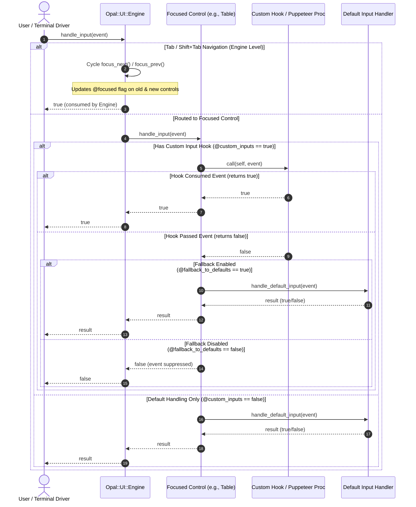
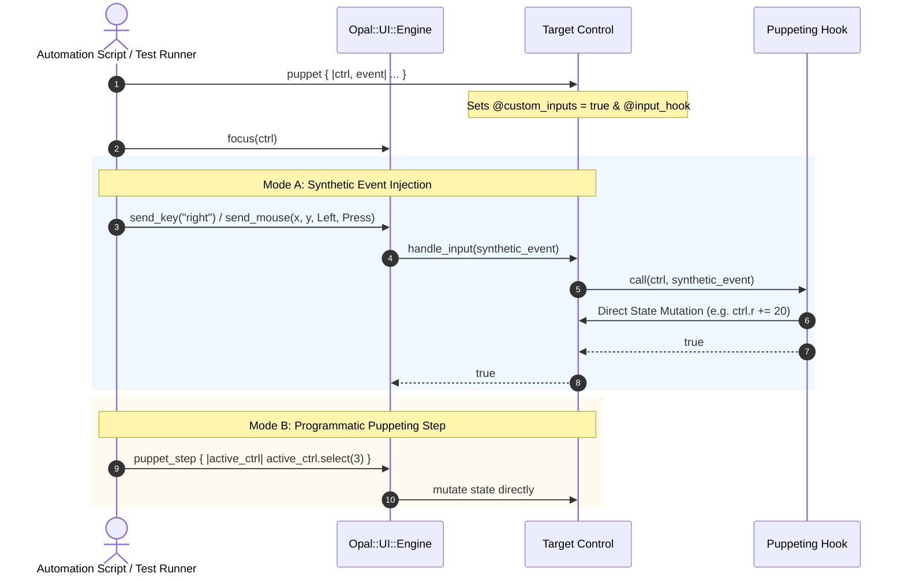

# 🎮 Architecture: Per-Control Input Hooks, Puppeting & UI Engine

This document details the architectural design, lifecycle contracts, and usage patterns for Opal's interactive control system (`Control`), per-control input hooks (`InputHookable`), and multi-control focus orchestration (`Engine`).

---

## 📑 Table of Contents

- [Overview & Philosophy](#-overview--philosophy)
- [Class Hierarchy & Separation of Concerns](#-class-hierarchy--separation-of-concerns)
- [Lifecycle Contracts & State Machine](#-lifecycle-contracts--state-machine)
- [Event Dispatch & Fallback Mechanics](#-event-dispatch--fallback-mechanics)
- [Programmatic Puppeting & Automation](#-programmatic-puppeting--automation)
- [Complete Copy-Pasteable Examples](#-complete-copy-pasteable-examples)
  - [Example 1: Creating a Custom Interactive Control](#example-1-creating-a-custom-interactive-control)
  - [Example 2: Adding Vim-Style Custom Input Hooks](#example-2-adding-vim-style-custom-input-hooks)
  - [Example 3: Puppeting a Table from Background Fiber](#example-3-puppeting-a-table-from-background-fiber)
  - [Example 4: Synthetic Event Injection for Headless Testing](#example-4-synthetic-event-injection-for-headless-testing)
  - [Example 5: Multi-Control Orchestration with Engine](#example-5-multi-control-orchestration-with-engine)
- [API Reference](#-api-reference)

---

## 🌟 Overview & Philosophy

In terminal applications, UI elements fall into two categories:
1. **Passive Visual Elements** (`Element`): Pure layout nodes that render state into a `Buffer` given an `(x, y, width, height)` bounding box. Examples include `Box`, `Text`, `Badge`, `Sparkline`, `BarChart`, and `LineGraph`.
2. **Interactive Stateful Controls** (`Control`): Components that can be focused, process keyboard and mouse input, maintain interactive cursor state, and be puppeted programmatically. Examples include `Table`, `FilterList`, `ColorPicker`, `ColorPicker3D`, and `FileDialog`.

Opal enforces a clean distinction between these two concepts while keeping visual rendering completely unified:
- Every `Control` is an `Element` (inheriting rendering and layout capabilities).
- Every `Control` includes `InputHookable`, granting it standard default input lifecycles (`setup_default_inputs`), per-control hook overrides (`on_input`), and puppeting (`puppet`).
- The `Engine` coordinates focus and input routing across multiple controls.

---

## 🏛️ Class Hierarchy & Separation of Concerns

```
                     ┌───────────────────────┐
                     │   Opal::UI::Element   │
                     │  (Abstract Base View) │
                     └───────────┬───────────┘
                                 │ inherits
                     ┌───────────┴───────────┐
                     │   Opal::UI::Control   │◄─── includes ───┐
                     │  (Interactive Widget) │                 │
                     └───────────┬───────────┘                 │
                                 │                      ┌──────┴──────────────┐
       ┌──────────────┬──────────┴───┬──────────────┐   │ Opal::UI::          │
       │              │              │              │   │   InputHookable     │
┌──────┴──────┐┌──────┴──────┐┌──────┴──────┐┌──────┴───┴──┐ (Hook & Puppet   │
│ ColorPicker ││ColorPicker3D││    Table    ││ FilterList  │  Contract)       │
└─────────────┘└─────────────┘└─────────────┘└─────────────┘└─────────────────┘
                                     ▲
                                     │ coordinates & focuses
                     ┌───────────────┴───────┐
                     │   Opal::UI::Engine    │
                     │  (Focus & Dispatcher) │
                     └───────────────────────┘
```

### Module Responsibilities

| Class / Module | Role | Core Methods |
| :--- | :--- | :--- |
| `Opal::UI::Element` | Base layout & rendering contract | `render`, `preferred_size` |
| `Opal::UI::InputHookable` | Input lifecycle, custom hooks, puppeting | `setup_default_inputs`, `on_input`, `puppet`, `reset_inputs`, `handle_input` |
| `Opal::UI::Control` | Abstract base class for interactive controls | `initialize` (invokes `setup_default_inputs`), `focused?` |
| `Opal::UI::Engine` | Focus tracking, Tab navigation, synthetic event dispatch | `add`, `remove`, `focus`, `focus_next`, `focus_prev`, `send_key`, `send_mouse`, `puppet_step` |

---

## 🔄 Lifecycle Contracts & State Machine

Every `Control` transitions through distinct input states based on user overrides:

| Mode | `@custom_inputs` | `@fallback_to_defaults` | `@input_hook` | Behavior |
| :--- | :---: | :---: | :---: | :--- |
| **Default Mode** | `false` | `true` | `nil` | All events pass directly to `handle_default_input` (`handle_key` / `handle_mouse`). |
| **Augmented Hook** | `true` | `true` | `Proc` | Custom hook receives events first. If hook returns `true`, event is consumed. If `false`, standard default handler executes. |
| **Exclusive Puppet** | `true` | `false` | `Proc` | Custom hook has sole authority. Standard defaults are completely disabled. Unhandled events are dropped. |
| **Reset / Restored** | `false` | `true` | `nil` | Calling `reset_inputs` clears `@input_hook` and invokes `setup_default_inputs`. |

---

## ⚡ Event Dispatch & Fallback Mechanics

Incoming terminal events traverse the following sequence:



---

## 🤖 Programmatic Puppeting & Automation

Puppeting allows driving controls entirely from code, automated integration tests, background fibers, or playback logs:



---

## 💻 Complete Copy-Pasteable Examples

### Example 1: Creating a Custom Interactive Control

```crystal
require "opal"

module MyApp
  # A customizable interactive numerical slider control inheriting from Opal::UI::Control
  class Slider < Opal::UI::Control
    property value : Int32
    property min : Int32
    property max : Int32
    property step : Int32

    def initialize(@value : Int32 = 50, @min : Int32 = 0, @max : Int32 = 100, @step : Int32 = 5)
      super() # Automatically calls setup_default_inputs
    end

    # 1. Lifecycle hook: Configure out-of-the-box keyboard & mouse bindings
    def setup_default_inputs : Nil
      @default_input_proc = ->(ev : Opal::UI::InputEvent) : Bool {
        case ev
        when Opal::Terminal::KeyEvent
          case ev.name
          when "left", "down"
            @value = Math.max(@min, @value - @step)
            true
          when "right", "up"
            @value = Math.min(@max, @value + @step)
            true
          when "home"
            @value = @min
            true
          when "end"
            @value = @max
            true
          else
            false
          end
        when Opal::Terminal::MouseEvent
          if ev.action == Opal::Terminal::MouseAction::Press
            true
          else
            false
          end
        else
          false
        end
      }
    end

    # 2. Rendering implementation
    def render(buffer : Opal::UI::Buffer, x : Int32, y : Int32, width : Int32, height : Int32) : Nil
      return if width <= 0 || height <= 0
      bar_w = Math.max(1, width - 10)
      ratio = (@value - @min).to_f / (@max - @min).to_f
      filled = (ratio * bar_w).round.to_i

      fg = focused? ? Opal::Color.cyan : Opal::Color.bright_black
      buffer.put_string(x, y, "[", fg: fg)
      buffer.put_string(x + 1, y, "=" * filled, fg: Opal::Color.green, bold: true)
      buffer.put_char(x + 1 + filled, y, 'O', fg: Opal::Color.yellow, bold: true) if filled < bar_w
      buffer.put_string(x + 1 + filled + (filled < bar_w ? 1 : 0), y, "-" * (bar_w - filled - (filled < bar_w ? 1 : 0)), fg: Opal::Color.bright_black)
      buffer.put_string(x + 1 + bar_w, y, "]", fg: fg)
      buffer.put_string(x + bar_w + 3, y, sprintf("%3d%%", @value), fg: Opal::Color.white, bold: focused?)
    end

    def preferred_size(available_w : Int32, available_h : Int32) : {Int32, Int32}
      {Math.min(available_w, 40), 1}
    end
  end
end
```

---

### Example 2: Adding Vim-Style Custom Input Hooks

```crystal
require "opal"

picker = Opal::UI::ColorPicker.new(Opal::Color.hex("#3498DB"))

# Attach custom input hook: Add Vim keys (h/j/k/l) and instant primary color shortcuts
picker.on_input do |ctrl, event|
  if event.is_a?(Opal::Terminal::KeyEvent)
    case event.name
    when "h"
      ctrl.adjust_active(-10) # Fast decrease
      true                    # Consumed!
    when "l"
      ctrl.adjust_active(10)  # Fast increase
      true                    # Consumed!
    when "j"
      ctrl.next_channel
      true
    when "k"
      ctrl.prev_channel
      true
    when "r"
      ctrl.color = Opal::Color.red
      true
    when "g"
      ctrl.color = Opal::Color.green
      true
    when "b"
      ctrl.color = Opal::Color.blue
      true
    else
      false # Return false to gracefully fall back to default inputs (+, -, arrows, tabs)
    end
  else
    false # Allow mouse clicks to fall back to standard color picker scrubbing
  end
end
```

---

### Example 3: Puppeting a Table from Background Fiber

```crystal
require "opal"

table = Opal::UI::Table.new(
  headers: ["Job ID", "Task", "Status"],
  rows: [
    ["#101", "Compile Kernel", "Running"],
    ["#102", "Run Spec Suite", "Queued"],
    ["#103", "Package Artifacts", "Pending"],
    ["#104", "Deploy Staging", "Pending"],
  ]
)

# Puppet the control: Handle all navigation from an automated script
table.puppet do |tbl, event|
  if event.is_a?(Opal::Terminal::KeyEvent) && event.name == "auto_tick"
    cur = tbl.selected_index || 0
    tbl.select((cur + 1) % tbl.rows.size)
    true
  else
    false
  end
end

# In a background fiber:
spawn do
  loop do
    sleep 500.milliseconds
    table.handle_input(Opal::Terminal::KeyEvent.new("auto_tick"))
  end
end
```

---

### Example 4: Synthetic Event Injection for Headless Testing

```crystal
require "opal"

engine = Opal::UI::Engine.new
table = Opal::UI::Table.new(headers: ["Name", "Score"], rows: [["Alice", "95"], ["Bob", "88"]])
picker = Opal::UI::ColorPicker.new

engine.add(table)
engine.add(picker)

# 1. Assert initial focus
puts engine.focused_control == table # => true

# 2. Inject synthetic Down arrow into Table
engine.send_key("down")
puts table.selected_index # => 0

# 3. Inject Tab key to switch focus to ColorPicker
engine.send_key("tab")
puts engine.focused_control == picker # => true

# 4. Inject synthetic key into ColorPicker
engine.send_key("right")

# 5. Inject synthetic mouse click
engine.send_mouse(15, 5, Opal::Terminal::MouseButton::Left, Opal::Terminal::MouseAction::Press)
```

---

### Example 5: Multi-Control Orchestration with Engine

```crystal
require "opal"

# 1. Instantiate controls
table = Opal::UI::Table.new(
  headers: ["Service", "Port", "Status"],
  rows: [
    ["API Gateway", "8080", "Active"],
    ["Auth Worker", "9000", "Active"],
    ["Postgres DB", "5432", "Idle"],
  ]
)

filter = Opal::UI::FilterList.new(
  items: ["production-us-east", "production-eu-west", "staging-us-east"],
  title: "Target Environment"
)

picker = Opal::UI::ColorPicker.new(Opal::Color.hex("#A6E3A1"))

# 2. Setup UI Engine
engine = Opal::UI::Engine.new([table, filter, picker])

# Focus change listener
engine.on_focus_change = ->(old_ctrl : Opal::UI::Control?, new_ctrl : Opal::UI::Control?) {
  # Trigger audio bell, update status bar, or redraw UI chrome
}

# 3. Interactive Main Loop
drv = Opal::Terminal.default_driver
drv.raw_mode do
  drv.hide_cursor
  loop do
    w, h = drv.size
    buf = Opal::UI::Buffer.new(w, h)
    
    # Left pane: Table
    table.render(buf, 0, 0, w // 2 - 1, h // 2)
    # Bottom left pane: Filter list
    filter.render(buf, 0, h // 2 + 1, w // 2 - 1, h // 2 - 1)
    # Right pane: Color picker
    picker.render(buf, w // 2 + 1, 0, w // 2 - 1, h)

    drv.write(Opal::Terminal::Screen.move_to(1, 1))
    drv.write(buf.to_s)
    drv.flush

    if event = drv.read_event
      break if event.is_a?(Opal::Terminal::KeyEvent) && event.matches?("escape")
      engine.handle_input(event)
    end
  end
ensure
  drv.show_cursor
end
```

---

## 📖 API Reference

### `Opal::UI::InputHookable`

- `focused? : Bool`: Returns true if the control currently holds input focus.
- `custom_inputs? : Bool`: Returns true if custom input hooks are active.
- `fallback_to_defaults? : Bool`: Returns true if unhandled events fall back to default input handlers.
- `setup_default_inputs : Nil`: Lifecycle method called during initialization and on `reset_inputs`. Configures `@default_input_proc`.
- `on_input(&block : self, InputEvent -> Bool) : self`: Attaches a custom input hook receiving `self` and `InputEvent`.
- `puppet(&block : self, InputEvent -> Bool) : self`: Alias for `on_input`.
- `use_custom_inputs!(enabled : Bool = true) : self`: Toggles custom input processing.
- `fallback_to_defaults!(enabled : Bool = true) : self`: Toggles fallback to default input procs.
- `reset_inputs : self`: Clears hooks and restores defaults by re-running `setup_default_inputs`.
- `handle_input(event : InputEvent) : Bool`: Dispatches event to hook or defaults.

### `Opal::UI::Engine`

- `add(control : Control) : self`: Adds a control; focuses it if it is the first control.
- `remove(control : Control) : self`: Removes a control and adjusts focus.
- `focused_control : Control?`: Returns the active control.
- `focus(control : Control) : self`: Focuses the specified control.
- `focus_at(index : Int32) : self`: Focuses the control at index.
- `focus_next : self`: Cycles focus to the next control (`Tab`).
- `focus_prev : self`: Cycles focus to the previous control (`Shift+Tab`).
- `blur : self`: Removes focus from all controls.
- `handle_input(event : InputEvent) : Bool`: Routes event to navigation or active control.
- `send_key(...) : Bool`: Injects synthetic key event.
- `send_mouse(...) : Bool`: Injects synthetic mouse event.
- `puppet_step(&block : Control -> Nil) : self`: Direct mutation step on focused control.
